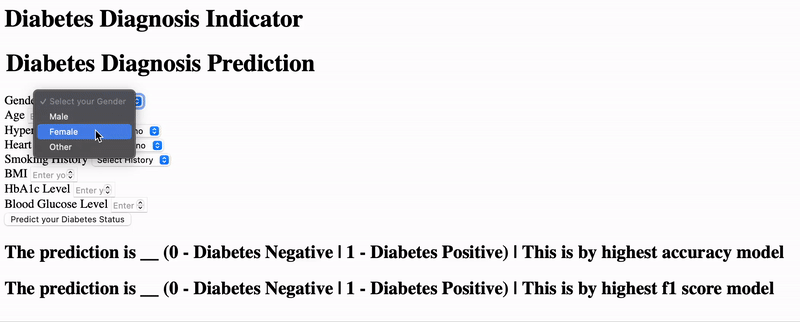

# Diabetes Diagnosis Classification 
# (An End-To-End ML Project using PyTorch and Scikit Learn)

#### Important Notes: 
The pipeline in this project trains a neural network, so training in reasonable time depends on your hardware.

If you just want to run pipeline and not the app run ```python3 main.py```

## Motivation

I wanted to create a complete pipeline for a decently sized dataset that trains and test many types of model families through grid search and stratified cross validation and outputs the best model to be used in a simple app. For this project I used a diabetes dataset that contains 100,000 data points.


</img>

## Simple Binary Classifaction Application


</img>

## Models being used: Neural Nets, Random Forests, XBGBoost, ADABoost, and CATBoost (you can add more model families!)


</img>


</img>

## Project / Pipeline Structure

#### For every "stage" added to the pipeline I added to the following in this order

1. Update config.yaml
2. Update params.yaml
3. Update the entity
4. Update the configuration manager in src config
5. Update the components
6. Update the pipeline 
7. Update the main.py


# How do I run this project locally?

### Steps:

#### 1. Clone the repository

```bash
git clone https://github.com/Anish-Mitagar/diabetes-diagnosis-ml-classification.git
```
#### 2. Create a conda environment after opening the repository

```bash
conda create -n diabetes python=3.9 -y
conda activate diabetes
```

#### 3. Install the requirements

```bash
pip3 install -r requirements.txt
```

#### 4. Run the app

```bash
python3 app.py
```


# How to do a AWS-CICD Deployment using Github Actions?

### 1. Login to AWS console.

### 2. Create IAM user for deployment

    Add the following policies:

	1. AmazonEC2ContainerRegistryFullAccess

	2. AmazonEC2FullAccess

    Save they access key and secret (download the .csv file when shown)

	
### 3. Create ECR repo to store/save docker image
    - Save the URI for later
    - Example URI:  5283647589263.dkr.ecr.us-east-1.amazonaws.com/{$repo_name}

	
### 4. Create EC2 machine (Ubuntu) 

### 5. Connect to EC2 Machine and install Docker :
	
```bash
sudo apt-get update -y

sudo apt-get upgrade

curl -fsSL https://get.docker.com -o get-docker.sh

sudo sh get-docker.sh

sudo usermod -aG docker ubuntu

newgrp docker
```

	
### 6. Configure EC2 as self-hosted runner:
    setting => actions => runner => new self hosted runner => choose os => then run command one by one

    (On the EC2 Machine name the runner "self-hosted")


### 7. Setup github secrets:

    AWS_ACCESS_KEY_ID =

    AWS_SECRET_ACCESS_KEY =

    AWS_REGION = us-east-1

    AWS_ECR_LOGIN_URI = 

    ECR_REPOSITORY_NAME = 


